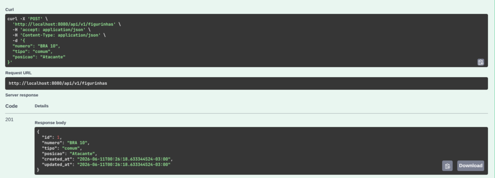
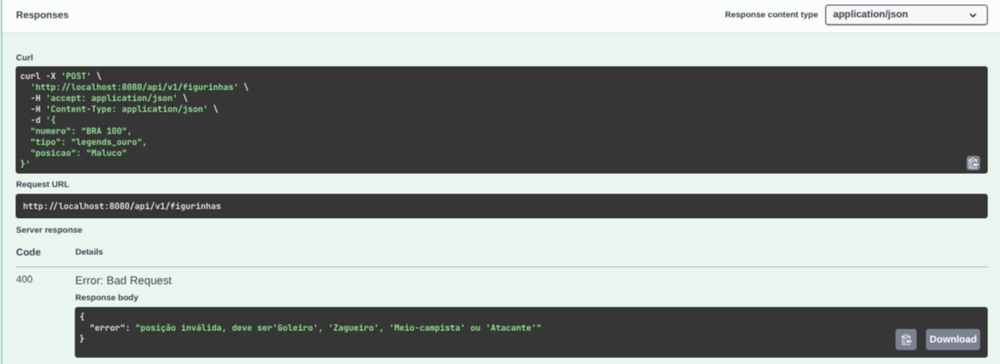
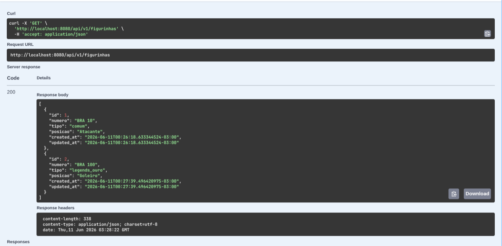
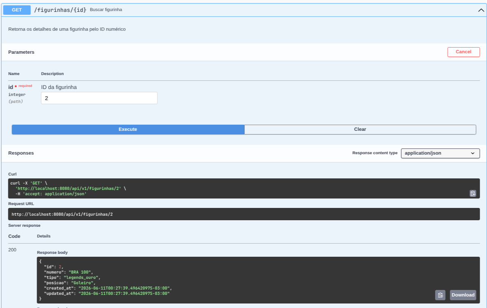
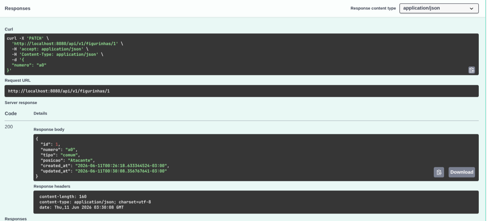
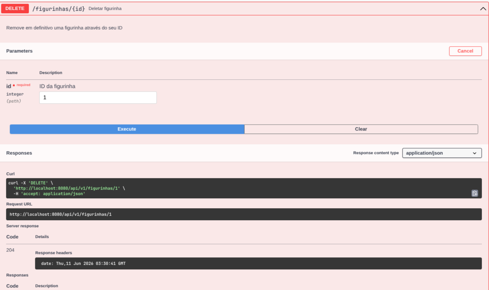

# cleanCode-golang

Atividade desenvolvida para trabalho em sala com foco em melhorar os conceitos de Clean Code aprendidos nas aulas. O objetivo principal foi criar uma API de gerenciamento de figurinhas para o álbum da Copa, aplicando uma arquitetura em camadas.

---

## Detalhamento de Desenvolvimento

Como pedido no enunciado da ponderada, dividi o projeto seguindo o modelo de camadas de referência que usamos em aula, garantindo que cada arquivo tivesse apenas uma única responsabilidade.

Aproveitei para separar também algumas tarefas extras com base a documentação do autoestudo, com a config, database e router como pastas extras para separar ainda mais as responsabilidades.

### Config
Comecei criando o `config.go` para centralizar a leitura das variáveis de ambiente. Usei o pacote `godotenv` para ler o arquivo `.env`.

O objetivo deste arquivo é criar uma função que define valores padrão (`getEnvOrDefault`), então se o `.env` sumir ou o caminho do banco mudar, o sistema não quebra.

Além do mais é um código a menos para inserir no main.

### Domain
No Domain segui a estrutura do enunciado enunciado da atividade, que pedia os campos `id`, `numero` `tipo`, `posicao`, `created_at` e `updated_at`.

Para melhorar o código criei dois Enuns para deixar fixados os campos "Tipo" e "Posição,`FigurinhaTipo`  e `FigurinhaPosicao` guardam os valores aceitos pelos campos, o que facilita barrar entradas inválidas.

Também criei structs separadas para as requisições (`CreateFigurinhaRequest` e `UpdateFigurinhaRequest`). No request de atualização, usei ponteiros (`*string`) para conseguir identificar quando o usuário enviou um campo em branco intencionalmente no `PATCH`, esta parte também foi pega da documentação do autoestudo.

### Repository
O repositório cuida somente do acesso ao banco de dados usando o GORM e o SQLite, aqui criei uma interface `FigurinhaRepository` seguindo a documentação do autoestudo para se adequar ao clean code.

No método `FindAll`, montei queries dinâmicas para filtrar por posição e tipo caso esses parâmetros venham na URL.

No método `Update`, passei a struct inteira para o `db.Save(figurinha)`, deixando que o próprio GORM identifique a chave primária e atualize o campo `updated_at` de forma automática.

### Services
Seguindo a lógica do clen code o service não pode saber o que é banco de dados e nem o que é HTTP, então criei outra interface nele.

Ele tem duas coisas que achei que podem ser colocadas depois em uma pasta "Utils" ou "Helpers" que são os erros padrão, que ficam guardados em variáveis, e os helpers de validação de "Tipo" e "Posição "com base o domain.

No `UpdateFigurinha`, a primeira coisa que pensei que seria bom colocar foi buscar se a figurinha existente pelo ID para garantir que ela existe antes de aplicar as alterações parciais do `PATCH`, então é uma pré validação antes de continuar com o código.

### Handlers
O Handler recebe a requisição HTTP, extrai os parâmetros, valida o JSON com o `ShouldBindJSON` e repassa o trabalho para o Service.

A principal coisa aqui além das requisições foi o tratamento de erros, que eu usei o `errors.Is` para capturar os erros customizados do Service traduzi eles nos status HTTP corretos (`404 Not Found` ou `400 Bad Request`), além de isolar o retorno de mensagens de erro em uma função helper.

Como os IDs mudaram para `uint`, o método tradicional do Gin para capturar parâmetros de URL precisava de um tratamento. Usei IA para criar uma função helper interna chamada `parseID`, que usa `strconv.ParseUint` para converter de forma limpa o parâmetro da rota de texto para `uint`, tratando IDs inválidos antes de acionar o Service.

### Routers
Aqui nas rotas, configurei o motor do Gin e agrupei os endpoints sob o caminho `/api/v1/figurinhas`. 

Além de mapear os verbos HTTP corretos (`POST`, `GET`, `PATCH`, `DELETE`), foi aqui que acoplei o middleware do Swagger para que a documentação ficasse acessível direto por uma rota dedicada.

### Main
O `main.go` inicializa as configurações do `.env`, abre a conexão com o banco SQLite e executa o `AutoMigrate` do GORM para criar a tabela de figurinhas se ela não existir.

Depois, fiz a Injeção de Dependência manual, instanciando o repositório, passando ele para o serviço, passando o serviço para o handler e, por fim, ligando o servidor na porta configurada.

---

## Uso de IA Generativa

A Inteligência Artificial foi utilizada como uma ferramenta de suporte eao longo do desenvolvimento, focando em e resolução de problemas técnicos e para tirar dúvidas de código

Usei inicialmente para entender melhor o comportamento de ponteiros em structs de validação do Go durante métodos de atualização parcial (`PATCH`), já que tinhamos dois domains iguais só que um usava ponteiro, confesso que quando saquei achei super interessante o uso.

Tamǘem usei para decifrar erros de tipagem do compilador ao converter tipos primitivos (`string`) para tipos nomeados (Enums do domínio), tive esse problema no service na parte de `figurinha.Posicao = domain.FigurinhaPosicao(*req.Posicao)`.

Além do mais no repository eu não havia entendido o porque do Golang usar a estrutrutura:

`func (r *figurinhaRepositoryImpl) FindAll(posicao, tipo string) ([]domain.Figurinha, error)`

Então pedi pro Gemini me explicar porque tantos parâmetros em uma única função e peloq ue entendi pode ser escrito assim 

`//func (Receiver-("Dono do método"))(Parâmetros de entrada)(variáveis de Saída)`


Por fim usei para ajudar a fazer as anotações de documentação (os comentários `// @Summary`, `// @Param`) dentro dos Handlers, garantindo que o swagger fizesse a documentação corretamente sem quebrar a rota do `doc.json`.

---

## Como rodar o projeto?

1. Certifique-se de ter o Go instalado na máquina.
2. Certifique-se de criar a pasta para o banco de dados na raiz do projeto:
   ```bash
   mkdir -p database

3. Crie um arquivo .env dentro de `/backend` e cole

```txt
PORT=8080
DB_PATH=./database/figurinhasCopa.db
```
4. Instale e sincronize as dependências

``` bash
go mod tidy

go install [github.com/swaggo/swag/cmd/swag@latest](https://github.com/swaggo/swag/cmd/swag@latest)

#Gera a documentação swagger se não estiver funcionando
$(go env GOPATH)/bin/swag init

```
5. Rode a aplicação
```bash
go run main.go
```

## Swagger

### 1. Cadastro de Figurinha com Sucesso (POST)
<p align="center">
  
</p>

### 2. Validação de Erro no Cadastro (POST com dados inválidos)
<p align="center">
  
</p>

### 3. Listagem Geral de Figurinhas (GET Geral)
<p align="center">
  
</p>

### 4. Busca de Figurinha Específica por ID (GET por ID)
<p align="center">
  
</p>

### 5. Atualização Parcial de Dados (PATCH)
<p align="center">
  
</p>

### 6. Remoção de Figurinha (DELETE)
<p align="center">
  
</p>
